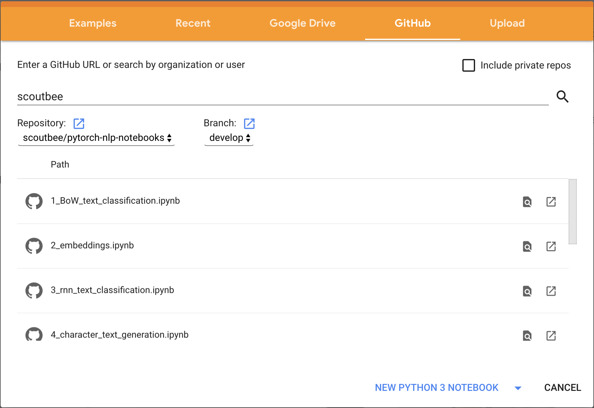

# A Deep Dive into NLP with PyTorch

Learn how to use PyTorch to solve some common NLP problems with deep learning.

- [`0_pytorch_intro.ipynb`](https://github.com/scoutbeedev/pytorch-nlp-notebooks/blob/master/0_pytorch_intro.ipynb): Introduction to PyTorch
- [`1_BoW_text_classification.ipynb`](https://github.com/scoutbeedev/pytorch-nlp-notebooks/blob/master/1_BoW_text_classification.ipynb): Train a bag-of-words model to predict the sentiment of IMDB reviews
- [`2_embeddings.ipynb`](https://github.com/scoutbeedev/pytorch-nlp-notebooks/blob/master/2_embeddings.ipynb): Play around with different pretrained word embeddings
- [`3_rnn_text_classification.ipynb`](https://github.com/scoutbeedev/pytorch-nlp-notebooks/blob/master/3_rnn_text_classification.ipynb): Train an LSTM to predict the sentiment of IMDB movie reviews
- [`4_bert_text_classification.ipynb`](https://github.com/scoutbeedev/pytorch-nlp-notebooks/blob/master/4_bert_text_classification.ipynb): Fine-tune the pretrained (small) BERT model to predict the sentiment of IMDB movie reviews
- [`5_gpt2_text_generation.ipynb`](https://github.com/scoutbeedev/pytorch-nlp-notebooks/blob/master/5_gpt2_text_generation.ipynb): Fine-tune the pretrained (small) GPT-2 model to generate weight loss articles


## Setup

Make sure you have a Google account and visit [Google Colab](https://colab.research.google.com/). The click on the `GitHub` tab, type in `scoutbeedev`, and press \<ENTER\>. You should see a list of notebooks pop up:



If you have trouble with that, you can also save the notebook you want to run from this repo to your local filesystem, and then upload it to Google Colab with `File -> Open Notebook -> Upload`.

### Basic Navigation

You can run cells with \<SHIFT\> + \<ENTER\>.

### Missing packages

If you find that you are missing a necessary package, you can prepend `!` to a bash command. For example, to install `googledrivedownloader`, you would run in a cell:

```
!pip install googledrivedownloader
```

### Using a GPU

To use a GPU (for free!), select from the top menu from Colab `Runtime -> Change Runtime Type -> Hardware Accelerator -> GPU`. Pay attention to how much memory the GPU is currently using by clicking `Runtime -> Manage Sessions`.
